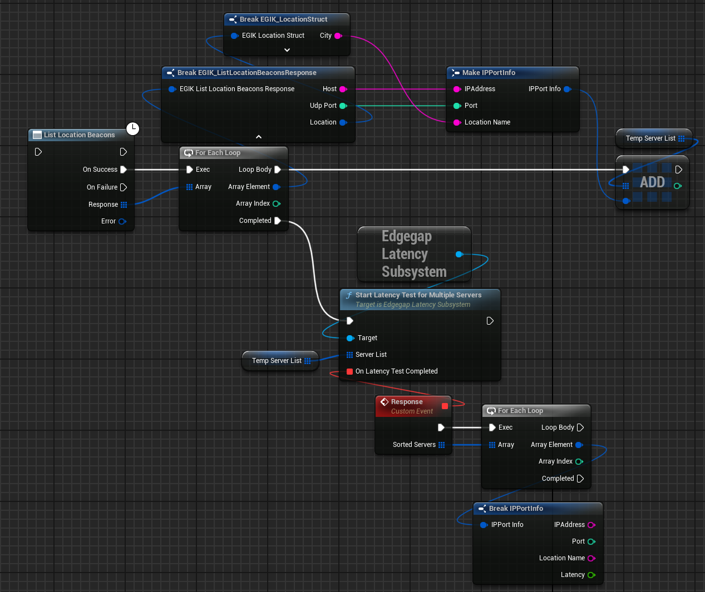

import { Callout } from 'nextra/components'

# Latency Test with Beacons

Edgegap provides multiple location beacons so that you can improve your game's matchmaking and deployment strategies.

Official Docs: [Edgegap Beacons](https://docs.edgegap.com/learn/matchmaking/ping-beacons/)

### Game Side Configuration

It's a very easy process to request for beacons and then ping them through the plugin. Here is a simple example of how you can do it:

  

## Matchmaking Usage

<Callout type="info">
    I will suggest you to use the Example Project as it covers the complete process of using beacons in the matchmaking process, and it's very easy to understand and copy/paste the code xd.
</Callout>

If you are using Matchmaking Gen2 with Edgegap, you can use the beacons to ping all servers and include the latency in the matchmaking process. Here is an example of how you can do it:

### Request & Ping Beacons

The first thing to do is to request the beacons from the Edgegap API, after that you can ping them to get the latency. Make sure to make a array of results as we will need it in the matchmaking process.

  

### Matchmaking Process

After you have pinged all the beacons, you can use the results to include the latency in the matchmaking process. Here is an example of how you can do it:

  

Done! You have successfully included the latency in the matchmaking process.