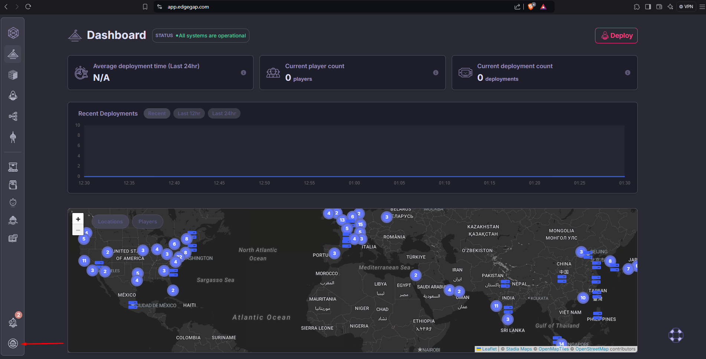
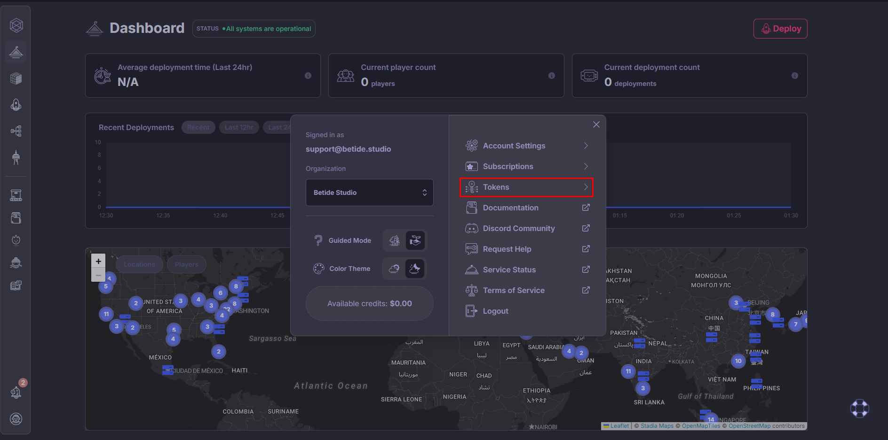
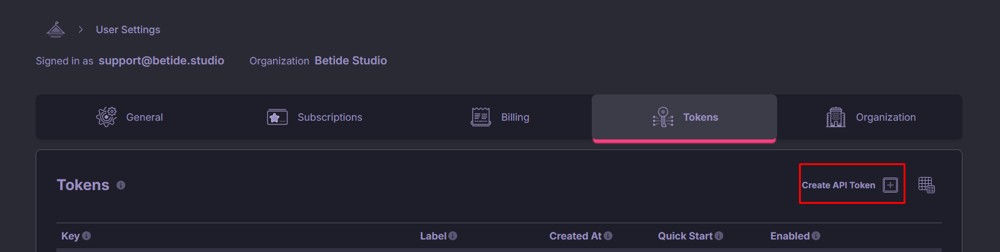
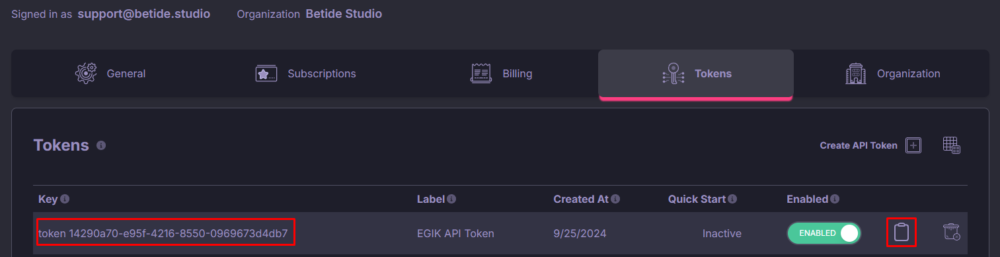
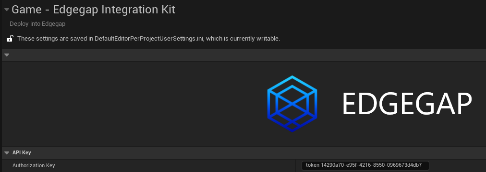
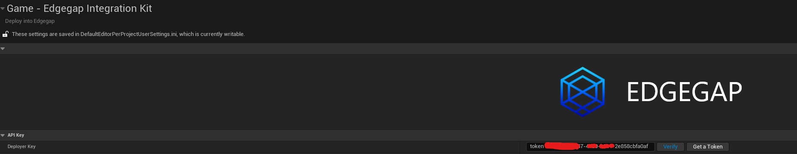

import { Callout } from 'nextra/components'

# Configuration

This section will guide you through the configuration of Edgegap's Integration Kit for Unreal Engine.

## Basics

Please note that in the project settings, you will see two options: **Authorization Key** and **Deployer Token**. 

### Authorization Key

The Authorization Key is a unique API key that allows you to authenticate with Edgegap's platform. This will be included in the headers of your API requests to Edgegap's API(handled by the Integration Kit).

1. Go to the [Edgegap Dashboard](https://app.edgegap.com/).

2. Click on the **Settings** tab.

  

3. Go to the **Tokens** section, present on the right side of the pop-up menu.

  

4. Press on **Create API Token** and give it a name. I will name it **EGIK API Token**. Make sure to set **Is Quick Start** to **False**.

  

5. Now when the token is created, click on the **Copy** button to copy the token to your clipboard and paste it in the **Authorization Key** field in the project settings.

  

  

Done! You have successfully added the Authorization Key to your project settings.

### Deployer Token

The Deployer Token is a unique API key that allows you to authenticate with Edgegap's platform and push builds to the Edgegap platform. This will be used to make and deploy server builds to Edgegap's platform.

1. Go to the [Edgegap Dashboard](https://app.edgegap.com/).

2. Click on the **Settings** tab.

  

3. Go to the **Tokens** section, present on the right side of the pop-up menu.

  

4. Press on **Create API Token** and give it a name. I will name it **EGIK Deployer Token**. Make sure to set **Is Quick Start** to **True**.

  

5. Now when the token is created, click on the **Copy** button to copy the token to your clipboard and paste it in the **Deployer Token** field in the project settings.

  

Done! You have successfully added the Deployer Token to your project settings.

