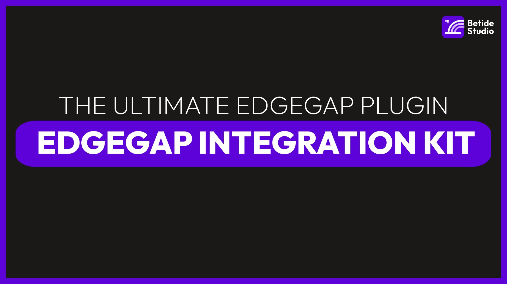

import { Tabs } from 'nextra/components'

# EdgeGap Integration Kit

   

The Edgegap Integration Kit simplifies the process of deploying and managing multiplayer game servers using Edgegap’s distributed orchestration platform. By leveraging Edgegap's automated game server deployment across its global edge computing infrastructure, you can ensure low latency, scalable server hosting, and seamless integration with Unreal Engine.

## Key Features

- Regionless Hosting: Automatically cache and deploy game servers across 615+ locations worldwide, ensuring optimal server placement with reduced latency.

- Cross-Platform Compatibility: Integrates seamlessly with Unreal Engine and other major platforms, supporting a wide range of game types and sizes.

- Bare Metal & Cloud Integration: Hybrid orchestration enables efficient hosting, combining bare metal servers for low-traffic periods and cloud infrastructure for spikes in demand.

- Instant DDoS Protection: Built-in defense mechanisms for keeping your servers secure and running smoothly.

- Fast Boot Times: Game servers deploy and become operational in under 3 seconds, allowing for rapid scaling to meet player demand.

- Pay-Per-Use Pricing: With no upfront costs, you only pay for server hosting when players are actively using your game.

- Easy Integration: Simple setup and configuration with the kit, allowing you to focus on developing your game rather than making API calls.

- Addon Integration: Supports EOS Integration Kit for Epic Online Services and Steam Integration Kit for seamless integration with the Steam platform.

## Support

If you encounter any issues or have questions about the Steam Integration Kit, please refer to the [documentation](/docs) or contact our [support team](/about) for assistance. We're here to help you make the most of your Edgegap integration and bring your game to the next level.