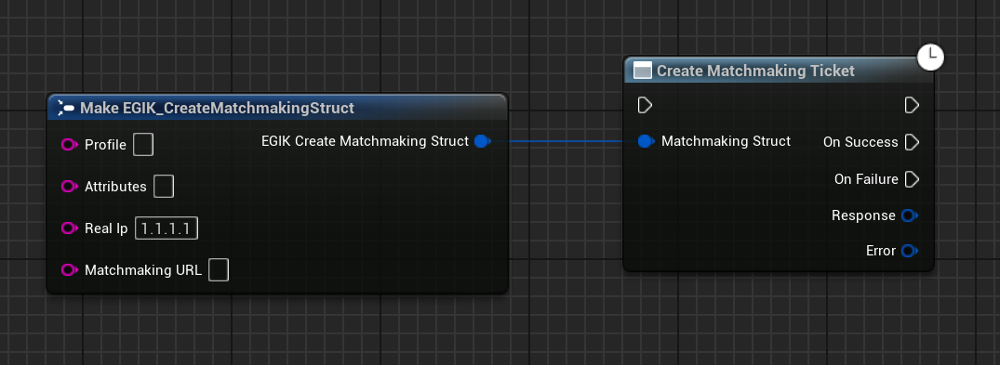
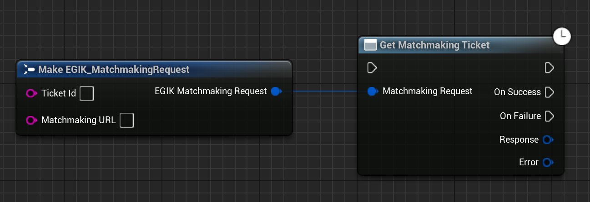
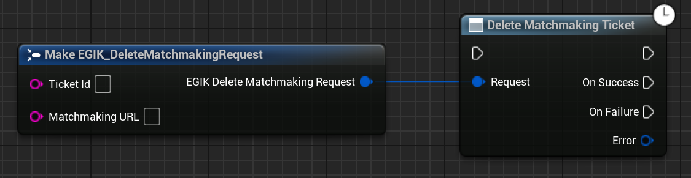
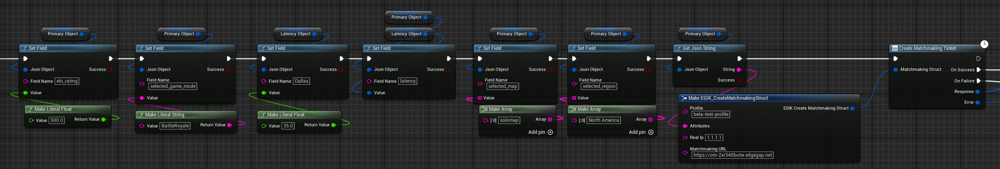
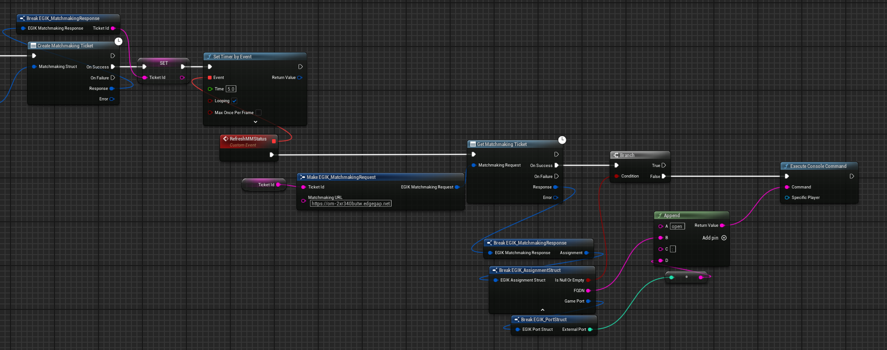
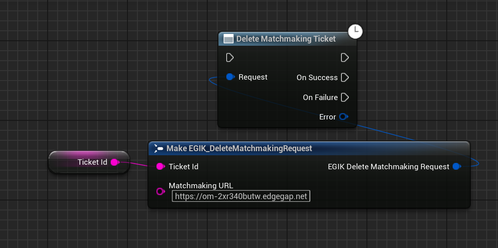

# Game Side Integration

### Overview

### Step 1: Setting Up the Blueprint Nodes

Edgegap Matchmaker provides several Blueprint nodes to help integrate matchmaking into your game logic.

#### Key Nodes:
- Create Matchmaking Ticket: Use this node to submit a matchmaking request. This node will send player attributes (e.g., region, latency) to the matchmaker for processing.

  


- Get Matchmaking Ticket: This node reads the current status of the matchmaking ticket, providing information on whether a player is in queue, matched, or assigned to a server.

  


- Delete Matchmaking Ticket: If a player cancels matchmaking, this node will delete the matchmaking request from the system.

  

#### Example Blueprint Workflow:

1. Initiating Matchmaking:
    - Call the Create Matchmaking Ticket node when the player clicks "Find Match."
    - Pass relevant player attributes (e.g., game mode, latency) to the node.

Usually, the player attributes are stored in a JSON format. Here is an example of a player profile JSON object:
    
```json 
{
    "profile": "beta-test-profile",
    "attributes":
    {
        "elo_rating": 500,
        "selected_game_mode": "BattleRoyale",
        "latency":
        {
            "Dallas": 35
        },
        "selected_map": [
            "solomap"
        ],
        "selected_region": [
            "North America"
        ]
    }
}
```

In Unreal, using the Json library, you can convert this JSON object to a string and pass it to the Create Matchmaking Ticket node.

  


2. Polling for Match Status:
    - Use Get Matchmaking Ticket in a loop to check the status of the match. Once a match is found, transition the player to the assigned game server.

  

3. Canceling Matchmaking:
    - If the player cancels matchmaking, call Delete Matchmaking Ticket to remove the ticket from the queue.

      


### Step 2: Testing

Once your Blueprint logic is set up, test your matchmaking functionality by deploying servers via Edgegap’s platform and ensuring players are correctly matched based on the rules defined in your configuration.

