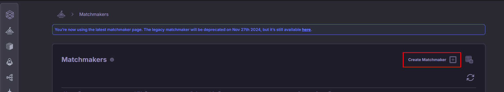
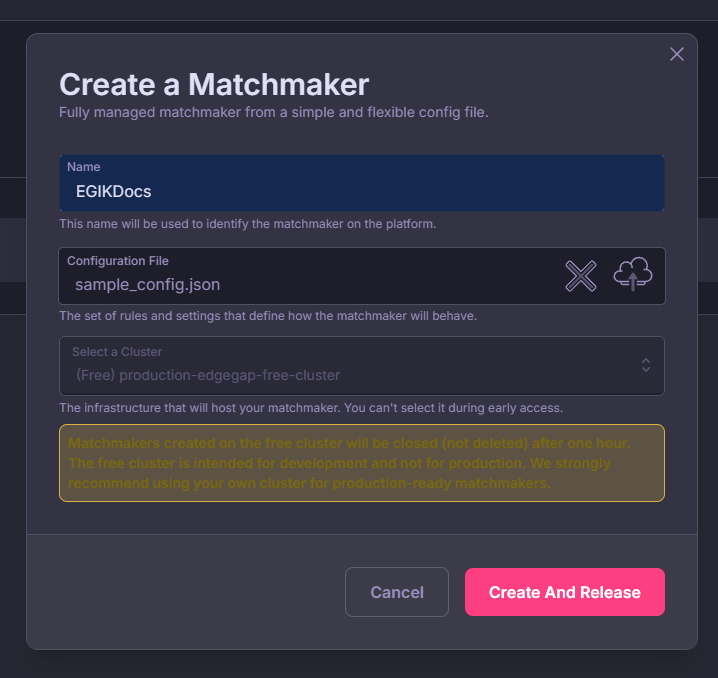
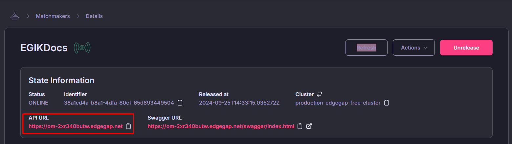

# Setup and Configuration

### Step 1: Define Matchmaking Rules

You’ll need to define rules to determine how players are matched in your game. Rules are created using a configuration file in JSON format. Make sure to save the file as `matchmaker.json` or something similar.

Here is an example:

Updated Example at : https://docs.edgegap.com/docs/gen2-matchmaker#simple-example

In this example, we have taken some variables which are used to match players together. Here is a brief explanation of each variable:

- `match_size` ensures four players are matched together.
- `elo_rating` restricts matches to players with similar skill levels.
- `latency` ensures players with low ping differences are paired for better performance.
- `name` and `version` are the name and version of your application that will be used to identify the server to be used for the match. More information can be found [here](https://docs.edgegap.com/docs/matchmaking/matchmaker-configuration#application).

### Step 2: Create a Matchmaker Instance

To get started, you will need to create a matchmaker instance through Edgegap’s web dashboard. You can access it [here](https://app.edgegap.com/matchmaker-management-v2/matchmakers/list).

1. Navigate to the Matchmaker Management section.
2. Press on the “Create Matchmaker” button.

  

3. Now enter the **Name** and the select the **configuration file** you created in Step 1.

  

Incase the application info is wrong, you will see a warning message. 

4. Press on **Create and Release** to create the matchmaker instance.

5. After the matchmaker is created and released (you will see a green icon), copy the **API URL** which will be used in your game client to connect to the matchmaker.

  

### Step 3 (Optional): Expansions for Queue Optimization

To prevent players from waiting too long, you can set up rule expansions that broaden the matchmaking criteria over time.

For instance:

After 10 seconds, increase the allowed Elo difference and latency threshold.
After 30 seconds, decrease the match_size target, allowing smaller groups to be formed.